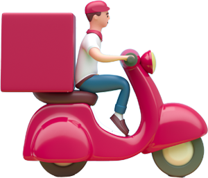

# gsap module

gonna bring the gsap

Using straight gsap in nuxt, don't need much config...

> yarn installs...

```
yarn add gsap
```
## Code Examples

```javascript

<template>
 <div ref='hello'>gsap</div>
</template>
//using setup within script...
<script>
import { onMounted, ref } from "vue";
import { gsap } from "gsap";

export default {
  setup() {
    const hello = ref();
    const animation = gsap.timeline({});
    const sayHello = () => {
      animation.to(hello.value, { rotation: "+=360" });
      animation.to(hello.value, { rotation: "+=360" });
      animation.to(hello.value, { rotation: "+=720" });
    }

    onMounted(() => {
      sayHello()
    });
    // ? try -> animation w/ external controls
    return {
      hello, sayHello, animation
    };
  },
};
</script>


```

## Drop-Ins...

> /components/

-   HelloGsap.vue

> /assets/images



> /assets/svg

-  currently embeded in controls

